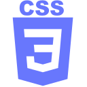
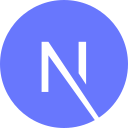
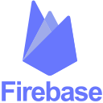
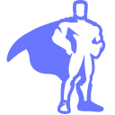

# Hi, I'm Brandi — a front-end developer & designer in Nashville.

 

I'm a highly driven, front-end focused developer that thrives in creative environments.

I am in search of a place to expand my programming knowledge and grow into a well rounded developer. [Reach out](mailto:hello@brandicameron.com) — let's create some cool things together!

# Tech Stack

-  HTML 5
-  CSS3
-  Javascript
-  React
-  Next.js
-  Firebase Auth, Firestore and Storage
-  Greensock
-  Sass
-  Tailwind
-  a11y Accessibility
-  Shopify
-  Adobe Photoshop
-  Adobe Illustrator

# Let's Connect

## [hello@brandicameron.com](mailto:hello@brandicameron.com)

## [www.brandicameron.com](https://brandicameron.com/)
